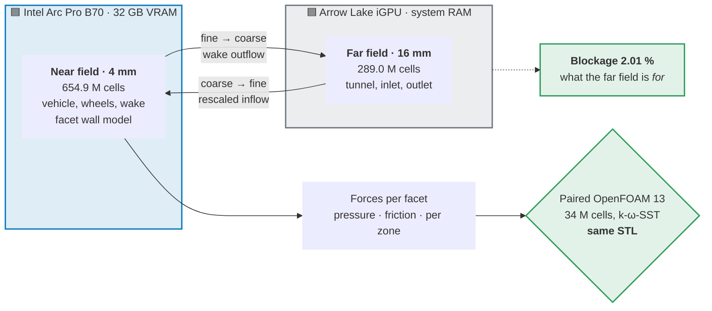
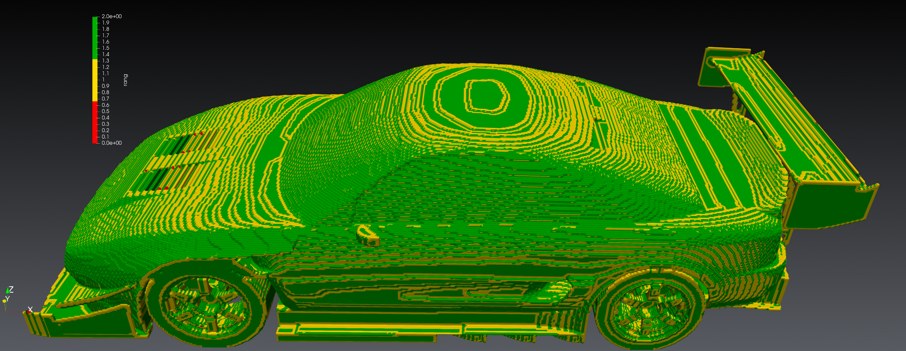

<div align="center">

# MaxAttack CFD Bench

### Vehicle aerodynamics at 4 mm on a single Intel GPU

**A lattice-Boltzmann wall-modelled LES that resolves the flow around a road vehicle<br>
on one workstation — and states how every number it reports was measured.**

<br>


</div>

> [!IMPORTANT]
> **Modified fork of [FluidX3D](https://github.com/ProjectPhysX/FluidX3D) by Dr. Moritz Lehmann.**
> This is **not** the original software and is not endorsed by its author. Licensed under the
> **unaltered** FluidX3D license — non-commercial use only, no military use.
> See **[NOTICE.md](NOTICE.md)** and **[MODIFICATIONS.md](MODIFICATIONS.md)**.

Built on [FluidX3D](https://github.com/ProjectPhysX/FluidX3D) by Dr. Moritz Lehmann. Upstream is
the fastest LBM solver of its class and reports 96–100 % of peak memory bandwidth. This fork does
not try to improve on that. Its main kernel reaches about three quarters of what upstream reaches
on the same Arc Pro B70 — the price of carrying a wall model and a sub-cell boundary in the hot loop
(measured, see *What sets the run time*). It adds what a vehicle aerodynamics case needs and upstream
does not have: a wall model, sub-cell boundary geometry, a two-device domain decomposition, and an
instrumentation layer that makes silent errors loud.

---

## 📊 At a glance

| | |
|---|---|
| **Case** | Road vehicle, 4 mm near field, Re ≈ 8 × 10⁶, moving ground, rotating wheel contact |
| **Grid** | **654.9 M** fine cells on an Intel Arc Pro B70 (32 GB) + **289.0 M** coarse far-field cells @ 16 mm on an Arrow-Lake iGPU |
| **Pressure drag** | **0.525** vs OpenFOAM 13 **0.548** — **96 %** of the reference (pressure field, contact band removed, time mean) |
| **Pressure downforce** | **−1.041** vs OF13 **−1.306** — **80 %** of the reference — *the open problem* |
| **Hardware** | One workstation. No cluster, no CUDA, no NVIDIA |
| **Memory** | **41.2 B per cell** on device at 4 mm, all buffers included (measured), against 93 B for upstream FP32 |
| **Bandwidth** | Main kernel `stream_collide` **399.8 GB/s of real DRAM traffic — 66 % of the B70's 608 GB/s peak** (VTune hardware counters, 2026-10-06), 77 % of what upstream reaches on the same card. Limited before DRAM: L3 93 % busy, 42 % of cycles stalled |
| **Pacer** | The **iGPU far field**, not the B70, sets the time per coarse step |
| **Proof** | Every mechanism carries an action-path counter with an is = should acceptance. Every change that must not alter the physics is accepted only bit-identical: same field hash, every export file byte-equal |

<sub>Forces: pressure field P1 (Σ 2 wᵢ (ρ − 1) cᵢ over the wall links), contact band = the lowest four
cell layers, time mean 0.201–0.741 s of the solver-side P1 series (4 mm run `p4_n10_std2`,
2026-10-06, ±0.009 / ±0.015); the 12-step reference `p4_b12_5L` gives the same mean within ±0.003. OpenFOAM 13: surface pressure without the same band.
Friction is left out on purpose; see *Results* for why, and for why the coefficients this page
quoted before 2026-10-04 were withdrawn.</sub>


*A 4 mm production run: `p4_bandpi2_4` (2026-09-22), Toyota MR2 at 30 m/s, near-field |u| on the
Y = 0.025 m slice at t = 500 ms — 15→45 m/s blue→white→red, black = solid. 654.9 M cells at 4 mm on
a single Arc Pro B70; engine bay with radiator fins resolved, rear wing attached, full turbulent
wake. This is an instantaneous LES field, not a mean. The run used 8 steps per cell, at which a
lattice mode is present above the roof (see* Status*); the forces on this page come from later runs.*

---

## 🎯 What this is, and what problem it solves

Vehicle aerodynamics at engineering accuracy normally means a RANS or hybrid solver on a cluster,
with a body-fitted mesh and a wall function that assumes the first cell sits in a log layer. That
route is well understood and expensive.

LBM is attractive for the opposite reason: it is a cartesian, memory-bandwidth-bound stencil that
maps almost perfectly onto a GPU. The price is that the wall is a **staircase of voxels**, not a
surface. At 4 mm on a car, a plain bounce-back wall behaves like a hydraulically rough one, the
stair-step normal is not the surface normal, and the boundary layer is unresolved by two orders of
magnitude.

Everything in this fork exists to pay that price honestly:

- **Recover the surface** from the voxel body — sub-cell wall distance per link, a fitted surface
  normal across the staircase, exact thin-feature voxelisation.
- **Model what the grid cannot resolve** — a facet-based wall model that drives the near-wall cell
  toward a law-of-the-wall target, plus a subgrid model that is consistent in the wall cell.
- **Fit a car on one GPU** — two-byte fields, velocity stored only where it is read, four-bit flags,
  and a coarse far field on the integrated GPU while the discrete card carries the near field.
- **Never trust a number that has no counter.** This is not a slogan; see *How every number is
  proven* below. It has repeatedly caught mechanisms that were computing in the wrong place while
  every global figure looked right — and it is also what withdrew this page's own earlier headline
  figures.

---

## 🧱 Why two domains: the blockage trap

A wall-modelled LES of a car needs two things that pull in opposite directions. The **near field**
must be fine enough to resolve the body — 4 mm. The **outer boundary** must be far enough away that
the tunnel walls do not squeeze the flow around the car and inflate the forces. That second
requirement is **blockage**: the model's frontal area against the tunnel cross-section.

Put numbers on it, and the trap is obvious:

| | Cross-section | Blockage vs A_ref = 1.850 m² | |
|---|---|---|---|
| Near box alone — 2.768 × 1.888 m | 5.23 m² | **35.4 %** | 🚫 unusable, the walls *are* the flow |
| With the far field — 10.160 × 9.072 m | 92.17 m² | **2.01 %** | ✅ at the 2 % convention |

> [!TIP]
> **2.01 % is what the solver reports for this grid**, 0.08 points above the paired OpenFOAM 13 case
> `mr2v40H` (1.93 %). A deeper far box at 1.875 % was run and not adopted: 0.2 points of blockage
> moved the pressure coefficients by only 3–18 % of one standard error, while the larger far field
> took away the iGPU's timing reserve.

**So why not simply make the fine grid that big?** Because of what it costs. The far-field box is
12.784 × 10.160 × 9.072 m = **1 178 m³**. Filled uniformly at 4 mm that is **18.4 billion cells** —
about **760 GB** at this fork's measured 41.2 B per cell. No workstation has that.

The two-domain split buys the same blockage for **944 M cells instead of 18.4 G — a factor of about
20** — by spending resolution only where the forces are made, and merely *being present* everywhere
else.

---

## 🔀 How the two devices split the problem



The discrete card's 32 GB buys resolution exactly where the forces are made. The domain that only
has to be *present* — the one that pushes blockage from 35 % down to 2 % — lives in system RAM,
where it costs nothing scarce. It does cost time: the iGPU is slower than the B70, and today it is
the far field that sets the pace of every coarse step (see *What sets the run time*).

---

## 📐 Results

The comparison is made on the **pressure field**, without the wheel-contact band, because that is
the quantity that is defined the same way in both solvers and at every grid spacing:

| 4 mm, contact band removed | FX (P1) | OpenFOAM 13 | FX / OF13 |
|---|---|---|---|
| **Pressure drag** | **0.525** | 0.548 | 96 % |
| **Pressure downforce** | **−1.041** | −1.306 | 80 % |
| Friction drag / lift | *not comparable yet* | 0.042 / +0.0065 | |
| *OF13 totals for reference* | | *Cd 0.599 · Cz −1.301* | |

<sub>FX: time mean 0.201–0.741 s of the solver-side P1 series, 4 mm run `p4_n10_std2` (2026-10-06);
the same mean for the 12-step reference `p4_b12_5L` agrees within ±0.003. The figures quoted here until
2026-10-06 (0.490 / −1.085) were the mean of two instantaneous fields and happened to be low. OF13: k-ω-SST, t = 1200, same STL, same zones, same band edge.</sub>

> [!NOTE]
> **Every mechanism in this fork carries an action-path counter with an is = should acceptance,
> and a switch without a firing counter is treated as a hard error.** The reason is concrete:
> in the predecessor fork, the central moving-floor fix was a silent no-op for years.
> See [How every number is proven](#how-every-number-is-proven).

**Why the figures above replace the ones this page used to show.** Until 2026-10-04 this page
quoted Cd 0.6085 / Cz −1.0535 from the facet momentum-exchange path (`cd_facetten.csv`) of the run
`p4_bandpi2_4`, and called the drag closed "within 1.6 %". Four findings withdrew that:

1. **The facet path is not comparable across grid spacings or against OF13.** Its projection keeps
   a non-pressure share of the momentum exchange F = Σ 2 fᵢ cᵢ (about +0.04 in Cd at 4 mm) that a
   wall pressure does not have, and that share changes with dx: of an apparent Cd drop of −0.061
   from 4 to 3.75 mm, about three quarters was measurement path and −0.015 was flow.
2. **The band edge followed millimetres, the band artefact follows the cell index.** One artefact
   layer sat in the "rest" at 4 mm only. The band is now a fixed four cell layers at every dx.
3. **The friction channel carried wall-normal momentum.** The sub-cell boundary booked its full
   momentum vector, including the wall-normal part, as friction. At 4 mm the booked friction lift
   was +0.079 against OF13's +0.007, and the direction of the modelled wall shear explains only
   +0.005 of that. Corrected on 2026-10-05: the normal part is now booked as pressure. The effect at
   4 mm is not measured yet, which is why friction is left out above.
4. **That run used 8 steps per cell**, at which a lattice mode is present above the roof (see
   *Status*).

**Why the band is split off.** The z-band around the wheel contact patch is a clamp artefact: the
wedge cells in front of and behind the contact patch sit at the density clamp (Δρ ≈ ±0.5),
independent of the flow. At 4 mm the band carries pressure drag 0.18 in P1 (0.26 in the facet path)
where OF13 carries 0.006. It is removed and reported separately rather than quietly absorbed.

**The reference.** A paired OpenFOAM 13 run, 34 M cells, k-ω-SST, on the **same STL**. Validating
against an earlier version of one's own code is banned by project rule: it can only find porting
errors, and it confirms shared mistakes.


***A 4 mm field against the OpenFOAM 13 reference***, Y = 0.025 m slice: ΔU = |u|_OF13 − |u|_FX,
red = OF13 faster, blue = OF13 slower / FX over-accelerated, ±15 m/s, black = solid. The red rim
hugging the body is the boundary layer — the wall model brakes slightly harder than the RANS
reference. The mottled wake is the snapshot-versus-mean caveat and not a discrepancy: FX is an
instantaneous LES field, OF13 a RANS mean, so resolved eddies are being held against a smooth
average. **The mean-flow regions are the part that carries meaning.** Field statistics over
636 437 evaluable cells, frames aligned by x_v2 = x_OF13 + 2.2063: **RMS 4.26 m/s, median
−0.57 m/s, 1.66 % of cells clipping the ±15 m/s scale**.

<sub>**Which run this diff is from.** This is the 4 mm run `p4dt_deteps` (2026-09-11), on the
smaller near box used before 2026-09-21. It is not the run whose forces head this page, and it is
labelled as what it is rather than substituted. Later runs differ in the Π-band wall treatment, whose
effect was measured separately at 12/8 mm (RMS against OF13 −9.9 %, share above 15 m/s −42.5 %).</sub>

**Where the downforce is lost** (zone decomposition, 4 mm, same fields, against OF13):

- **Rear wing, +0.16.** The suction side separates over the rear 40 % of the chord, where OF13 stays
  attached; the total pressure of its inflow at 4 mm matches OF13. It is the same mechanism as the
  project's main problem — the wall treatment under an adverse pressure gradient.
- **Nose, x < 0.8 m, +0.12…0.17.** The cooling-air duct is practically closed at 4 mm: the
  voxelised louvre block leaves passages two cells high, which carry 0.1 % of OF13's flow rate.
  Only part of the nose deficit is the duct.
- **The roof zone itself matches** (Cz +0.288 vs +0.284), but the boundary layer arriving at the
  rear is too thick: the total-pressure loss integral over windscreen and roof is already two to
  five times OF13's.

**Resolution alone does not close the gap.** The same B70 has now run the vehicle at 3.5 mm with
816.5 M near-field cells (`p35_m375_zk`, 2026-10-06, see below). Time-averaged P1 without band over
0.201–0.741 s: **0.521 / −1.027** at 3.5 mm against 0.525 / −1.041 at 4 mm — 95 % / 79 % of OF13 at
both resolutions. Finer cells do not move the forces toward OF13. (Earlier 3.75 mm and 3.5 mm runs
used smaller near boxes; the 3.5 mm one also a shorter far box that made the far field 1–2 m/s too fast.)

### The 4 mm production runs, measured

| | `p4_b12_5L` (2026-10-04, last full run) | `zb4_kurz_1` (2026-10-05, new memory default, short run) |
|---|---|---|
| Fine cells @ 4 mm (B70) | **654.9 M** | **654.9 M** |
| Coarse cells @ 16 mm (iGPU) | **289.0 M** | **289.0 M** |
| Steps per cell | 12 | 12 (only changes the step count) |
| Near-field VRAM, solver report | 28 698 MiB | **25 687 MiB** (−3 011) |
| Near-field peak — per cell, all buffers | 28 746 MiB — 46.0 B | 25 735 MiB — **41.2 B** |
| Lowest free VRAM, desktop included | 2 433 MiB | 5 445 MiB |
| Far-field memory | 12 956 MiB system RAM, no VRAM ceiling | same |
| Coarse step | 501.7 ms | 494 ms (settled) |
| Time loop | **8 518 s (142 min)** for 740 ms | 1 888 fine steps only |

The 3 GB come from three changes, each accepted at 8 mm with the anchor's field hash unchanged:
velocity stored only where it is read (U_RAND), four-bit flags (FLAGS4), and the force list
restricted to wall cells (KF-FILTER, which changes only the summation order and thus the last bits
of the force sums).

**4 mm with the new memory levers** (`p4_n10_std2`, 2026-10-06, 10 steps per cell): 25 687 MiB on the B70,
6 925 s for the 741 ms time loop. At 10 steps per cell, however, the lattice mode appears above the roof at
4 mm, so the default went back to 12 steps per cell; a 4 mm wall-clock figure with 12 steps and all levers
has not been measured yet. Byte cell bases alone raise the near-field throughput by 2.7 %.
The 75 min this page used to quote was `p4_bandpi2_4`: 501 ms at 8 steps per cell, not comparable.

### 3.5 mm: 816.5 M near-field cells on one 32 GB card

`p35_m375_zk` (2026-10-06): near field at 3.5 mm on the B70, far field at 14 mm on the iGPU, 12 steps
per cell, 740 ms of physical time. Every figure below is taken from the run's own log.

| | 3.5 mm |
|---|---|
| Near field (B70) | 2 033 × 765 × 525 = **816.5 M cells** |
| Far field (iGPU) | 437 M cells at 14 mm, 19.6 GB system RAM |
| Distributions, dense → row-compacted | 29 590 → **27 048 MiB** (−2 542); 70.1 M solid cells are not stored |
| Velocity field, full → stored only where read (U_RAND) | 4 672 → **1 397 MiB** |
| Free VRAM before the time loop | **1 630 MiB** (32 GB card, desktop included) |
| Time loop | **14 045 s (3 h 54 min)**, no driver or device error |
| Check kernel for the compact layout | 0 / 0 / 0 / 0 (pass) |

**What made it fit.** The levers act together, and each one was accepted at 8 mm with the anchor's
field hash unchanged:
- two-byte distributions, density and velocity;
- velocity stored only where it is read (U_RAND);
- density only on the boundary shell;
- four-bit flags (FLAGS4);
- the force list restricted to wall cells (KF-FILTER).

The step to 3.5 mm came from **row compaction (ZKS)**. Rows of the
lattice skip their solid run, a per-row table maps cells to storage, and the distributions are made
resident and checked against the table before the time loop starts.

**What it costs.** At 8 mm, row compaction adds 2.8 % to the near-field kernel time. The wall
clock does not see it. At 3.5 mm the far field on the iGPU sets the pace: the B70 waits about
149 ms per coarse step (21 %), measured from the run's coupled-step timing. A near-field cost below
that margin does not reach the run time. The next performance work therefore targets the far field
(its damping layer is 40 % of its cells).

### What sets the run time

**First, a correction.** Earlier versions of this page reported **572 GB/s = 94 % of peak**. That was
the solver's display convention — MLUPs from a sphere case (2026-08-08) multiplied by upstream's
bytes-per-cell formula, which counts every cell, including solid ones, and fields the main kernel does
not write every step. It is not a measured bandwidth. A traffic balance on 2026-09-11 found the display
47 % above the real traffic.

**Measured with VTune DRAM hardware counters** (2026-10-06, 8 mm vehicle): `stream_collide` moves
**399.8 GB/s** (203.1 read + 196.6 write) — **66 %** of the B70's 608 GB/s peak, 75 % of a triad measured
on this card (531 GB/s), **77 % of what upstream FluidX3D reaches on the same card (520 GB/s)**; 76.3 B per
fluid cell, matching the byte model within 0.3 %. The L3 is 93 % busy. The far-field kernel on the iGPU is
compute-bound (XVE 70 % active, 97 % occupancy, at its 2.0 GHz maximum) and uses about 50 GB/s of system memory. And it is **not bandwidth-bound**: of its stall samples, 41 % are active,
29 % wait for load data, 10 % for instruction fetch, and only 7.7 % for a full memory queue. Code size,
instruction issue and load latency limit it — the wall-model, sub-cell-boundary and band paths live
in the hot kernel. At upstream's bandwidth the kernel would need 11.1 instead of 14.5 ms (−24 %);
that is the ceiling of all kernel-level work.

**The B70 is not the pacer.** Per coarse step at 8 mm (VTune): B70 kernel time 62.8 ms, iGPU far field
**67.0 ms**, coarse step 66.6 ms — the discrete card waits. At 4 mm a near-field gain reaches the wall
clock only in part: byte cell bases saved 13.9 ms per coarse step on the B70, of which 5.3 ms arrived
(−2.8 % near-field time, −1.0 % coarse step). Performance work therefore goes to the far field and to
the order of the coupled step first.

**Memory.** At 4 mm the distributions are 92 % of the near-field VRAM (breakdown under *What a cell
costs*), so further layout savings are small; 56.1 M solid cells (2 033 MiB) are dead space that only
an indirection — row compaction — can recover. Row compaction is now built: it is the lever that put a
816.5 M-cell near box at 3.5 mm on the 32 GB card (see *3.5 mm: 816.5 M near-field cells*).

Earlier versions of this page carried a run-time projection to larger NVIDIA cards. It rested on the
94 % figure and on the assumption that the B70's bandwidth sets the run time; both are withdrawn, so
the projection is too. What remains without any assumption: cells go as dx⁻³ and the step count as
dx⁻¹, so **the next halving in dx costs a factor of sixteen in work** — on any hardware, because that
factor is physics, not silicon.

### Independent validation rigs

| Rig | What it settles | Result |
|---|---|---|
| **Sphere resolution ladder**, D/dx 11 → 37.5 | Does the wall model beat plain bounce-back on a body whose drag is known from experiment? | Converges monotonically from below to **Cd 0.436** against the 0.45–0.5 subcritical band (Achenbach); the bounce-back baseline sits at **0.717**, 50–60 % over |
| **Plane channel**, N = 20, Lee & Moser | The wall model against a case with a literature answer | c_f coverage **48 % → 80 %** of the reference after taking the model input from the second fluid cell |
| **Tilted channel torus**, 0° / 26.565° / 45° | Isolates the staircase: the same physical wall presented as flat, as a 2:1 stair, as a 45° stair | Showed that a *global* sampling factor cannot fit a staircase — the per-class scatter is the diagnosis |

---

## 🧬 What this fork adds to upstream FluidX3D

Upstream is a general-purpose LBM solver. None of the following exists there; all of it was added
for this case. Every figure was measured on this rig.

### Wall treatment — the core of the fork

| Addition | Why it is needed | Measured effect |
|---|---|---|
| **Facet wall model (iMEM)** — TLS surface fit across the voxel staircase, Spalding target, 3×3 momentum solve for a slip velocity, with a saturation gate | Bounce-back on a 4 mm grid is a rough wall, and the stair normal is not the surface normal | Vehicle Cd 0.818 → **0.728** at 8 mm; action path proven at 1.3 G events, is = should exact |
| **ELIBB** — link-wise sub-cell boundary from a Surface-Nets remesh; the q > ½ branch is an MLS blend whose stability limit was derived, then measured | Places the wall where it is, instead of on the nearest cell face | **13.1 M cut links on 3.13 M facets** at 4 mm, **zero fallbacks**, stable to ω → 2 |
| **Model input from the second fluid cell** | The first cell is bounce-back-deflated *and* sits in the stair shadow; the fitted factor it replaced was calibrated on one geometry at one resolution | Channel u_τ factor **0.696 → 0.920**, c_f **+66 % at 38 σ** |
| **Mass-conserving momentum exchange** (α = 2 + gate) | The facet model injects momentum; uncorrected it also injects mass, and the leak *grows* with resolution | Sphere Δm 458.7 → **−1 × 10⁻⁶**; the uncorrected leak scales 272 → 13 149 from D/dx 11 to 37.5 |
| **Π-consistent multi-layer subgrid band** | The wall-cell subgrid model needs a consistent estimator outward from the first layer | Roof shape factor H **2.019 → 1.613**, friction **−16.9 %** (8 mm, friction as booked before 2026-10-05) |
| **Conserving clamps** (positivity, velocity) | Density and velocity clamps can shift forces *systematically*, not as realisation scatter | At 8 mm a systematic shift, proven with a 50-sample sign test; at 4 mm not present (Δ cd 0.005 ± 0.022). Standard since 2026-09-16 |
| **Force booking by channel** | The sub-cell boundary's momentum has a wall-normal part; it belongs to pressure, not to friction | Booked once, in the pressure channel, since 2026-10-05; a per-sample time-base and booking self-test runs in every run |

### Geometry

| Addition | Why | Effect |
|---|---|---|
| **SAT voxelizer** — ray-parity bulk plus every cell any triangle intersects (exact triangle–box overlap), then interior void sealing | Ray parity drops any feature whose entry and exit land in the same cell — wing end-plates, splitter, louvres simply vanish | At 4 mm resolves wheel spokes, brake ducts, diffuser strakes, underfloor channels, wing + Gurney, splitter, canards, louvres, mirror. **Open:** in the cooling-duct louvre block it leaves passages only two cells high, which carry no flow at 4 mm |
| **The voxel body is the only wall truth** | Voxelisation thickens; an STL-derived normal and a voxel-derived normal disagree, and the wall model then silently mixes two geometries | Project rule: wall distance, normal and link occupancy all come from the same body |

### Fitting a car on one workstation

| Addition | Effect |
|---|---|
| **Two-device domain decomposition** — fine near field on the B70, coarse far field on the iGPU, with a smoothed coupling | The far field costs system RAM instead of VRAM |
| **Compact fields** — two-byte distributions, density and velocity; velocity stored only where it is read, density only on the boundary shell, flags in four bits | **41.2 B per cell** measured at 4 mm, all buffers; 4 mm near field **28 698 → 25 687 MiB** on 2026-10-05 |
| **Sparse field writes**, register-level scheduling, byte cell bases | Measured lever by lever at 8 mm, each bit-identical: sparse velocity writes −1.5 %, byte cell bases −3.3 % wall clock |
| **Row compaction (ZKS)** — each lattice row skips its solid run; a row table maps cells to storage, checked by its own kernel before the time loop | Distributions at 3.5 mm 29 590 → 27 048 MiB; with it the 816.5 M-cell near field at 3.5 mm fits with 1.6 GB to spare; +2.8 % near-field kernel time at 8 mm, wall clock unchanged |
| **12 steps per cell** — the lattice velocity below the measured lattice-mode limit | 10 steps would save 18.8 % wall clock at 4 mm, but there the lattice mode appears above the roof (spanwise mode share 0.83 against 0.009 at 12), so the default stays at 12 (2026-10-06) |
| **Real VRAM accounting from `/proc/*/fdinfo`** | `intel_gpu_top` cannot see the B70 — the `xe` driver has no i915 PMU. Root-free per-device utilisation instead of a reconstruction |

### Intel platform robustness

Upstream assumes a well-behaved driver. On `xe` and Arrow-Lake it is not always one: a teardown
segfault after the last export, a GEM-BO leak of 12–16 GB per killed run on the iGPU, zero-copy
buffers that spin above ~1 GB, and a discrete card whose host mirrors are freed where the integrated
one keeps them. Each of these is worked around, documented with its detection method, and written so
it can be retested on a future driver.

---

## 🔬 How every number is proven

This is the part that generalises beyond this car.

**Every mechanism carries an action-path counter** with a declared target. A switch whose counter
does not fire is a hard error, not a curiosity — in the predecessor fork a central fix had been a
silent no-op for years. Counters are checked as `is = should` against a number derived
independently, not against themselves.

**Bit-identity is the acceptance for everything that must not change the physics.** Every memory
and performance change is run against an anchor and accepted only if the hash over the whole
near-field state (`FELD-HASH`) is identical **and** every export file is byte-equal (`cmp`). The test
ladder is CPU → iGPU → B70; the iGPU and the B70 produce the same hash, and a CPU hash is never
compared with a GPU hash. That is how three gigabytes of VRAM were taken out of the 4 mm run without
a single changed bit in the flow field. Deviations are allowed only where they are intended and
named — a new output column, or force sums whose summation order changed.

**Diagnostics live in the code**, not in a notebook. Each new mechanism gets intermediate-result
introspection so that a small test case shows whether the *steps* are plausible, not only the
final force.

**Three independent audit passes** run after every build section — one over each function, one over
host and pipeline interplay, one over the interaction with other mechanisms and dead code. Findings
are fixed and re-checked until clean, and the corrections get their own pass. A representative catch:
a subgrid band whose action-path counter matched its target to the last digit was dereferencing
bounding-box indices as global grid indices — correct on the channel, where the two spaces coincide,
wrong on the vehicle. The counter was right and the mechanism was computing in the wrong place.

**One variable per run**, criteria written down *before* the run. Mixed arms invalidate results
retroactively, and you find out only when you go looking for a cause.

**Rejections are kept visible.** A mechanism that was built, measured and found not to work is a
result. Keeping it on record is what stops it being proposed again.

**Every run carries its own source.** A full code copy, the commit hash and a build fingerprint of the
binary (commit, dirty flag, hash of the source diff) land in `export/<run>/code/`, so "which code
produced this number" is answerable six weeks later without archaeology. GPU runs go through a locked
queue with a status file and a process census.

---

## ⚙️ Build and run

```bash
g++ src/*.cpp -o bin/FluidX3D -std=c++17 -pthread -O -Wno-comment \
    -I./src/OpenCL/include -L./src/OpenCL/lib -lOpenCL
```

Cases and mechanisms are selected by `CFD_*` environment variables; the production configuration is
generated from a machine-written baseline file (`basis/*.basis`) rather than assembled by hand —
reconstructing one by hand once cost a full morning of measurements.

---

## 🚦 Status

<div align="center">

| | | |
|---|---|---|
| 🚧 | **Downforce** | **80 %** of the reference (pressure, 4 mm, time mean) — *the open problem* |
| 🚧 | **Drag** | **96 %** of the reference (pressure, 4 mm, time mean) — nearly closed |
| 🚧 | **Roof boundary layer** | too thick on windscreen and roof; same wall-treatment mechanism as the wing |
| 🚧 | **Rank-1 wall cells** | restoration stage 4 run at 4 mm: boundary layer toward the reference, downforce away from it — not in the default |
| ✅ | **Memory default 2026-10-05** | 4 mm near field −3 011 MiB, field hash unchanged |
| ✅ | **Steps per cell** | 10 — lattice mode sets in between 10 and 9 (8 mm); onset at 4 mm not yet measured |
| 🚧 | **4 mm run with the new default** | not yet run — the next step |

</div>

**Lattice mode.** From mid-September to 2026-10-03 every run used 8 steps per cell. At that lattice
velocity a standing lattice mode (spanwise period about three cells) forms above the roof, with a
pressure-coefficient rms of 0.46 at 4 mm. A sweep at 8 mm placed its onset sharply between 10 and 9
steps per cell; at 4 mm, however, 10 steps per cell still carry the mode (2026-10-06), so the default is 12. The mode was not the main cause of the
early separation: removing it at 8 mm moved the separation point by +1.5 SE only.

| Steps per cell (lattice velocity) | 8 mm: spanwise mode share | 4 mm: spanwise mode share | 4 mm: Cp rms above the roof |
|---|---|---|---|
| 8 (u = 0.125) | 0.90 | 0.90–0.91 | 0.53–0.56 |
| 9 (u = 0.111) | 0.84 | – | – |
| 10 (u = 0.100) | 0.015 | **0.83** | 0.22 |
| 12 (u = 0.083) | 0.014 | **0.009** | 0.067 (turbulence only) |

<sub>Block above the roof (x 2.2–3.0 m, z 1.35–1.7 m); mode share = fraction of the fluctuation power at the
spanwise period of about three cells, from a 3-D FFT of each density snapshot. 8 mm: sweep of 2026-10-05.
4 mm: snapshots at ≥ 600 ms of the runs `p4_ref_5L`/`p4_r1q4_5L` (8), `p4_n10_std2` (10) and `p4_b12_5L` (12);
an independent FFT on the field gives 0.89 at a period of exactly 3.00 cells for 10 steps. The onset moves to a
lower lattice velocity (more steps per cell) as the grid gets finer, so the 8 mm limit does not carry over; forces averaged over
the window did not change between 10 and 12 steps (0.525 / −1.041 against 0.527 / −1.047).</sub>

### The open problem, made visible: rank-1 wall cells on gently sloping surfaces

<div align="center">



*Tangential rank of every **first-layer** wall cell (a fluid cell with at least one face neighbour in the
solid), projected onto the faceted surface. Green = rank 2, yellow = rank 1, red = rank 0.
**Coarse resolution: this is the 8 mm grid.** At 4 mm the terraces are narrower and the pattern finer;
the mechanism is the same.*

</div>

A voxelised sloping surface is a staircase. The flat terraces are **rank 2**: the wall model can impose
shear in both tangential directions. Every **step edge is rank 1**: its wall links span only the
direction *along the edge*. On the roof, the bonnet and the rear screen these edges form rings like
contour lines. Where the rings run *across* the flow — exactly at the windscreen-to-roof and
roof-to-rear transitions, where the boundary layer separates too early — the wall model can only act
spanwise. In the flow direction those cells are plain bounce-back.

Measured on the 8 mm vehicle (first layer only):

| | windscreen | roof | rear |
|---|---|---|---|
| share of first-layer cells with rank 1 | 34 % | 43 % | 48 % |
| median \|cos\| between the one solvable direction and the flow | 0.19–0.24 | 0.61–0.72 | 0.43–0.60 |

At the windscreen the model therefore reaches only 4–6 % of the streamwise wall shear on a third of the
wall layer. These cells almost never fall back (0.5–2.5 %) — they are *served*, just in the wrong
direction, which is why they went unnoticed. Rank 1 concentrates on gentle slopes: 61 % of the rank-1
cells are tilted 5–20° against the nearest grid axis. Rank 0 is practically absent from the first layer
(251 of 577 355 cells); the single-link rank-0 cells that an earlier wall-cell reconstruction targeted
are edge-touching cells of the *second* layer, not the wall layer itself, so the work moved to rank 1.

**What has been tried.** Restore the missing tangential direction as a mass-free cell source whose
amplitude comes from the wall model of the same cell — no hand-set knob. Three variants on the 8 mm
vehicle, judged on the boundary-layer field at the roof (at 8 mm the forces are not an indicator):

- *model target only* — no measurable effect (the source is small against bounce-back and below the
  FP16 storage quantum);
- *full rank-2 equivalent* — the boundary layer on the roof plateau becomes as thin as in the reference
  (δ99 28 mm vs 148 mm, reference 29–39 mm), but the near-wall flow collapses further aft: the reverse-flow
  fraction of the first cell at x = 2.9–3.6 m doubles (0.41 → 0.83, +3.4 SE, three snapshots each against the
  *model target only* run);
- *the same without the isotropic pressure part of the bounce-back exchange* (stage 4) — the first variant
  that moves the field the right way. Seven field snapshots per arm (0.30–0.74 s), mid-plane:

  | roof, 8 mm | baseline | this variant | change | reference |
  |---|---|---|---|---|
  | shape factor H, roof plateau | 1.61 | **1.51** | −0.10 (4.4 SE) | 1.17 |
  | shape factor H, suction peak | 2.33 | **1.95** | −0.38 (2.9 SE) | – |
  | near-wall u_t at x = 2.5 m | 6.6 m/s | **8.9 m/s** | +2.3 (2.9 SE) | 24–32 m/s |
  | δ99, roof plateau | 149 mm | 147 mm | none | 29–39 mm |

  The direction is right for the shape factor and the near-wall velocity; the gap to the reference is still
  large. SE is a lower bound — consecutive snapshots are correlated.

**Stage 4 at 4 mm** (2026-10-03, paired against the same run without it, both at 8 steps per cell,
seven snapshots each, force window 0.501–0.741 s):

| 4 mm | without | stage 4 | change |
|---|---|---|---|
| shape factor H, roof plateau | 1.635 | **1.542** | −2.1 SE |
| near-wall u_t at x = 2.9 m | 2.91 m/s | **3.78 m/s** | +7.8 SE |
| reverse-flow share at the roof end | 0.25 | 0.42 | +3.3 SE — *more* |
| separation point | 3.60 m | 3.59 m | none (censored in 4 and 5 of 7) |
| cz_rest (facet path) | −1.062 | −1.035 | +3.7 SE — *less downforce* |

The boundary-layer shape moves toward the reference, but the reverse flow at the roof end grows and
downforce is lost — located at the underbody below the start of the cabin (x 1.4–2.1 m), not at the
windscreen. Stage 4 is therefore the best measured state of this line of work but not part of the
default.

**What was rejected after that:**

- a restriction of the source to the roof — excluded on principle: every wall treatment must hold for
  any vehicle shape, so no geometric special zones;
- a corrected variant (K2) that looked favourable at 8 mm and lost three times as much downforce at
  4 mm (cz_rest +0.081, +9.8 SE) — its formula leaked the bounce-back cross exchange into the flow
  direction. It is also the clearest demonstration of why 8 mm cannot judge forces;
- an incremental node reconstruction of the first fluid cell after the literature (all established
  cartesian wall-model LBMs rebuild that cell completely) — it diverged on the CPU test cases with
  positive feedback, because the wall cell controls only half of its own flux. Stopped; a
  literature-faithful reconstruction is a separate project.

The measurements behind every claim above — including the arms that were rejected — live in the
project's working notes and the run archive, which are kept out of this repository on purpose: they
are a laboratory notebook, not documentation. The commit history carries the same record in the
form that belongs here.

### Next steps

1. **A 4 mm production run with 12 steps per cell and all memory levers** — the reference for the
   next physics changes; the corrected friction booking and the solver-side P1 series are in place.
2. **Performance, far field first** — the iGPU sets the pace, so the far-field kernel, the boundary
   kernels and the order of the coupled step come before any B70 kernel work. Each lever is measured
   before it is built.
3. **3.5 mm is reached** (816.5 M near-field cells, row compaction). What remains is a far field that
   no longer holds the B70 back: a thinner damping layer and box-size ladders that check where the far
   field's imprint on the near field stops changing.
4. **The roof, the main problem** — the boundary layer separating too early from windscreen over roof
   to rear: a wall treatment that works under an adverse pressure gradient on the staircase, for any
   vehicle shape. A diagnosis channel with the flow driven *across* the steps (the existing tilted
   channel drives it along them and cannot show the defect) is the planned test rig with a DNS answer.

---

## 🗺️ LBM solver landscape — why FluidX3D on this hardware

An LBM step reads and writes every cell's distributions and does comparatively little arithmetic in
between. **Two numbers therefore decide most of it: how many bytes a cell costs per step, and what
fraction of peak bandwidth the code actually reaches.** Everything else is features.

### What a cell costs, and why it is the whole game

**Two different numbers, and they are often confused.** *Storage* is what a cell occupies in VRAM;
*traffic* is what must cross the memory bus every time step. The resolution you can fit is set by
storage; the run time is set by traffic — as long as the kernel is bandwidth-bound.

| Storage per cell, on device | | |
|---|---|---|
| Upstream, FP32 throughout | 93 B | |
| Upstream, FP16S for the distributions | 55 B | |
| **This fork, dense part** | **38.5 B** | 38 (19 × FP16S) + 0.5 (four-bit flags); velocity and density are stored only where they are read |
| **This fork, measured at 4 mm** | **41.2 B** | 25 735 MiB peak for 654.9 M cells, all buffers included |

> [!NOTE]
> **Where the 4 mm near-field VRAM goes** (solver balance of `zb4_kurz_1`, within 82 MiB of the
> `fdinfo` measurement of 25 859 MiB): distributions **23 735 MiB (92.1 %)** · compact velocity
> 1 049 · flags 312 · facets, band, force list 603 · coupling and planes 58 · density shell 20 —
> 25 777 MiB in total. Before 2026-10-05 the same run needed 46.0 B per cell. Older figures on this
> page (47 / 45.7 / 43.8 B) belonged to earlier layouts, and the 43.8 B divided MiB by 10⁶ bytes.

| Traffic per cell per step | | |
|---|---|---|
| Textbook D3Q19, two lattices, FP32 | 152 B | 19 × 4 B, read + write |
| FluidX3D, FP32/FP32 | 153 B | upstream, [`README_UPSTREAM.md`](README_UPSTREAM.md) |
| FluidX3D, FP32/FP16 — distributions + flags only | 77 B | upstream, same source |
| This fork, upstream's formula (display convention) | 112.5 B | `bandwidth_bytes_per_cell_device()`, `src/lbm.cpp` |
| **This fork, `stream_collide`, byte model** | **≈ 76.5 B** per fluid cell | 19 × 2 B read + write, 0.5 B flags; solid cells exit before the first distribution load |

The display convention counts u (6) + ρ (2), the force field (12) and 18 B of neighbour flags for
every cell. The main kernel does not move them per cell and step: velocity and density are written
only where they are read, the force field lives in a list over the wall cells, and the neighbour
flags are loaded only at the roughly one million moving-boundary cells.

> [!TIP]
> **Arithmetic intensity 2.37 / 5.27 / 16.56 FLOPs per byte** (FP32/FP32, FP16S, FP16C — upstream's
> figures). At those ratios no GPU on the market is compute-limited for LBM. That does not make the
> kernel automatically bandwidth-bound: this fork's kernel, carrying the wall-model paths, is limited
> by instruction issue and load latency instead (VTune, above).

### Reaching peak bandwidth — what we measured ourselves

| | |
|---|---|
| Arc Pro B70, peak | 608 GB/s ([Puget Systems](https://www.pugetsystems.com/labs/articles/intel-arc-pro-b70-review/), vendor figure — the same source's 22.94 TFLOPS matches our own device query, 22.938) |
| Triad, measured on this card | 531 GB/s |
| Upstream FluidX3D, measured on this card | 520 GB/s |
| **This fork, `stream_collide`, 8 mm vehicle** | **399.8 GB/s = 66 % of peak, 77 % of upstream** — VTune DRAM hardware counters (2026-10-06); the byte model (76.5 B per fluid cell, 397 GB/s) agrees within 0.3 % |
| Upstream's claim across vendors | 96–100 % of peak |

> [!IMPORTANT]
> **We have no comparable figure for any other solver.** Published MLUPs numbers are not comparable
> without the bytes-per-cell of the same build, and we have not benchmarked the others on this
> hardware. Stating a percentage for them would be a guess, so this table does not.

### Which solvers run on this hardware at all

| Solver | GPU backend | Runs on Intel Arc? | Built-in wall model |
|---|---|---|---|
| **FluidX3D** | OpenCL | ✅ **native** | ❌ — *this fork adds it* |
| Palabos | C++ stdpar since the 2025 GPU port ([arXiv:2506.09242](http://arxiv.org/abs/2506.09242)) | ⚠️ hardware-agnostic in principle, untested here | ✅ Werner–Wengle |
| OpenLB | SYCL / CUDA | ⚠️ experimental on Intel | ✅ Musker + van Driest |
| waLBerla | CUDA / HIP | ❌ | ✅ generic (power-law, Spalding) |
| TCLB · lbmpy · Musubi | CUDA / HIP | ❌ | partly |
| Sailfish | OpenCL | ⚠️ abandoned upstream | ✅ Bouzidi + power-law |

### What none of them solves

Several carry a wall function. **None carries a wall model that works on a staircase-voxelised
curved body at automotive Reynolds numbers** — the case where the surface normal is not the cell
normal and about half of all wall facets cannot span two tangential directions (4 mm census: rank 2
50.8 %, rank 1 30.7 %, rank 0 18.6 %). That gap is the reason this fork exists, and it is the part
that is genuinely hard — and, as *Status* shows, still open.

The honest summary: **FluidX3D was chosen because it is the only production-grade LBM solver that
runs natively on this hardware and moves the fewest bytes per cell.** What it lacked for a vehicle
— the wall model, sub-cell boundary geometry, the two-device split — is what the fork adds.

## 🔗 Companion repositories

Same hardware, same fight — getting a professional CFD stack to run on Intel instead of NVIDIA.

<div align="center">

[](https://github.com/heikogleu-dev/Paraview---Intel-B70-Pro-OSPRAY-Raytracing-Pathtracing)

[](https://github.com/heikogleu-dev/Openfoam-v2512-Petsc-Kokkos-Sycl-Intel-B70)

[](https://github.com/heikogleu-dev/Openfoam13---GPU-Offloading-Intel-B70-Pro)

</div>

---

## 📚 Original FluidX3D documentation

The upstream README is preserved verbatim as **[README_UPSTREAM.md](README_UPSTREAM.md)** — including
upstream's benchmark tables and, importantly, its **reference list**. Publications that use this
software must cite those references. Upstream's user documentation is likewise preserved as
[DOCUMENTATION.md](DOCUMENTATION.md).

Nothing on this page replaces those. Where this README and the upstream one disagree about what the
software does, the difference is a modification made here, and
[MODIFICATIONS.md](MODIFICATIONS.md) is the place it is accounted for.

---

## ⚖️ License & Attribution

> [!WARNING]
> **This is not FluidX3D.** It is a modified version of it, and it is **not endorsed** by FluidX3D's
> author. *"FluidX3D"* is a protected work title of Dr. Moritz Lehmann.

- Original software: **FluidX3D**, © 2022–2026 **Dr. Moritz Lehmann** —
  <https://github.com/ProjectPhysX/FluidX3D>
- License: **[LICENSE.md](LICENSE.md)**, byte-identical to upstream and not to be altered.
  Non-commercial use only. No military or defence use. No AI training on the source. Altered
  versions must be marked as such and their source published. The FluidX3D references must be cited
  in scientific publications.
- Attribution notice: **[NOTICE.md](NOTICE.md)**
- What was changed, and what deliberately was not: **[MODIFICATIONS.md](MODIFICATIONS.md)**

This fork is marked as altered, its origin is not misrepresented, the license notice is preserved,
and its source is public. Internal code identifiers still carry the upstream names so that upstream
changes remain mergeable — that is a compatibility decision, not a claim of identity.
